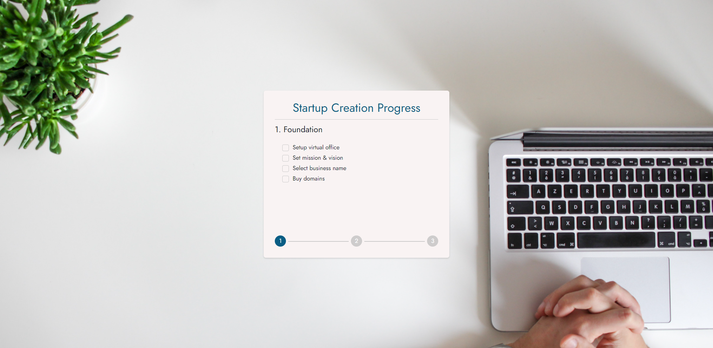

# STARTUP CREATION

# Instructions

One time limited task which was done for a job interview, it was done under 4 hours as it was a requirement.

## Requirements:

- Every phase can have an unlimited amount of tasks
- If the startup accomplishes all tasks in the phase, it’s marked as done and
  unlocks the next phase.
- Tasks cannot be marked as completed unless all tasks in the previous phase
  were completed.

### Requirements - Frontend:

- Implement in React
- Store the progress in local storage
- When all phases are completed, display a random fact from
  https://uselessfacts.jsph.pl/random.json

## System Requirements

- Node.js 12.22.0 or later
- MacOS, Windows (including WSL), and Linux are supported

## Instaling the dependencies

- be sure to have Node.js instaled `https://nodejs.org/en/`
- start the `cmd` of you choosing and navigate to the project folder
- type `yarn install` or `npm install`

## Starting the server

- Run `npm run dev` or `yarn dev` to start the development server on `http://localhost:3000`
- Visit `http://localhost:3000` to view your application
